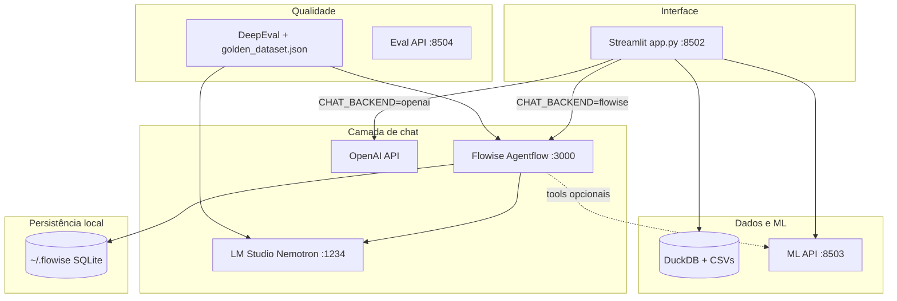

# Atividade Somativa 02 — Assistente de Negociação (Lumina Cosmetics)

Sistema de apoio à negociação de compras de insumos cosméticos, combinando **chat conversacional**, **dados analíticos (DuckDB)**, **classificação de risco (ML)** e **avaliação de qualidade (DeepEval)**.

Repositório: [github.com/rsspcss-pixel/Atividade_somativa02](https://github.com/rsspcss-pixel/Atividade_somativa02)

---

## Checklist de entregáveis

| Item | Status | Local |
|------|--------|-------|
| Código-fonte completo e organizado | OK | `Flowise/docker/` (Streamlit, Flowise, ML, eval) |
| README profissional | OK | Este arquivo |
| `requirements.txt` com versões pinadas | OK | `Flowise/docker/streamlit/requirements.txt` |
| `.env.example` documentado | OK | `Flowise/docker/streamlit/.env.example` |
| Golden dataset + testes | OK | `eval/golden_dataset.json` (41 casos) + `test_guardrails.py`, `eval/test_assistente_negociacao.py` |

> **Sincronização com o GitHub:** confira `git status` antes de entregar. Alterações recentes (Nemotron, latência, agentflow) precisam de **commit e push** para refletir no repositório remoto.

---

## Descrição

O projeto simula o departamento de compras da **Lumina Cosmetics** (fábrica fictícia de cosméticos). O usuário interage por chat sobre lotes mínimos, EOQ, cobertura de estoque e negociação com fornecedores. A interface Streamlit integra:

- **Chat** via Flowise (local + LM Studio) ou OpenAI (Streamlit Cloud)
- **Consultas DuckDB** sobre CSVs de insumos (~25k linhas)
- **Modelo ML** de risco de renegociacao (UCI Default of Credit Card Clients, adaptado)
- **Guardrails** de entrada/saída (injeção, PII, rate limit)
- **DeepEval** com golden dataset para regressão de qualidade

---

## Arquitetura



**Fluxo local (desenvolvimento):** `start-stack.ps1` sobe LM Studio → Docker (Flowise, Streamlit, ML API) → `bootstrap-flowise.ps1` instala o agentflow no SQLite do Flowise.

**Fluxo Cloud:** Streamlit Cloud executa apenas `app.py` com `CHAT_BACKEND=openai` e conhecimento embutido (`knowledge_base.py`), sem depender de Flowise externo.

---

## Stack tecnológica

| Camada | Tecnologia |
|--------|------------|
| UI | Streamlit 1.56, Python 3.11 |
| Orquestração de agentes | Flowise (Docker), Agentflow v2 |
| LLM local | LM Studio + `nvidia/nemotron-3-nano-4b` |
| LLM Cloud | OpenAI `gpt-4o-mini` |
| Dados | DuckDB, pandas, CSVs sintéticos |
| ML | scikit-learn, joblib |
| APIs | FastAPI, uvicorn (ML + Eval) |
| Avaliação | DeepEval 4.x, pytest |
| Vetor (opcional) | ChromaDB |
| Infra | Docker Compose, PowerShell scripts |

---

## Estrutura do repositório

```
Atividade_somativa02/
├── README.md                          # Este documento
└── Flowise/
    ├── README.md                      # Monorepo Flowise (upstream)
    ├── docs/                          # Deploy, guardrails, segurança
    └── docker/
        ├── docker-compose.yml
        ├── setup.ps1
        ├── start-stack.ps1            # LM Studio + stack + bootstrap
        ├── bootstrap-flowise.ps1
        ├── configure-lmstudio-nemotron.ps1
        ├── flowise/
        │   ├── agent_config.py        # Modelo, prompt, velocidade
        │   ├── agentflow_builder.py
        │   ├── install_negociacao_agent.py
        │   └── tools/*.json           # Custom tools Flowise
        └── streamlit/
            ├── app.py                 # App principal (Streamlit Cloud entry)
            ├── requirements.txt       # Deps pinadas (produção)
            ├── requirements-docker.txt
            ├── .env.example
            ├── config.py / cloud_chat.py / knowledge_base.py
            ├── data/                  # CSVs, docs, golden implícito nos txt
            ├── ml/models/             # risco_renegociacao.pkl
            ├── eval/
            │   ├── golden_dataset.json
            │   ├── test_assistente_negociacao.py
            │   └── README.md
            └── test_guardrails.py
```

---

## Como rodar

### Pré-requisitos

- Docker Desktop
- Python 3.11+ (scripts locais)
- [LM Studio](https://lmstudio.ai/) com CLI `lms` no PATH (chat local)
- Modelo `nvidia/nemotron-3-nano-4b` baixado no LM Studio

### Stack completo (recomendado)

```powershell
cd Flowise/docker
.\setup.ps1                 # cria .env a partir dos exemplos
.\start-stack.ps1           # LM Studio + Docker + bootstrap agentflow
```

| Serviço | URL |
|---------|-----|
| **Streamlit (chat)** | http://localhost:8502 |
| Flowise | http://localhost:3000 |
| ML API | http://localhost:8503/health |
| LM Studio | http://localhost:1234/v1 |

### Apenas Streamlit (Cloud)

1. Push para GitHub → [share.streamlit.io](https://share.streamlit.io)
2. **Main file path:** `Flowise/docker/streamlit/app.py`
3. **Secrets:**

```toml
CHAT_BACKEND = "openai"
OPENAI_API_KEY = "sk-..."
OPENAI_CHAT_MODEL = "gpt-4o-mini"
CHROMA_ENABLED = "0"
```

Guia: [Flowise/docs/deploy-streamlit-cloud.md](Flowise/docs/deploy-streamlit-cloud.md)

### Dataset e modelo ML

```powershell
cd Flowise/docker/streamlit
python seed_demo_data.py --train-ml
```

### Testes

```powershell
cd Flowise/docker/streamlit
pip install -r requirements-docker.txt
python -m pytest test_guardrails.py -q
```

DeepEval (41 goldens, requer stack + LM Studio):

```powershell
cd Flowise/docker
.\run-eval.ps1
```

Detalhes: [Flowise/docker/streamlit/eval/README.md](Flowise/docker/streamlit/eval/README.md)

---

## Configuração (.env)

Copie e ajuste:

```powershell
cd Flowise/docker/streamlit
copy .env.example .env
```

Variáveis principais:

| Variável | Local | Cloud |
|----------|-------|-------|
| `CHAT_BACKEND` | `flowise` | `openai` |
| `FLOWISE_API_URL` | URL prediction Docker | — |
| `FLOWISE_API_TOKEN` | `local-dev` | — |
| `OPENAI_API_KEY` | — | `sk-...` |

Documentação completa: [`streamlit/.env.example`](Flowise/docker/streamlit/.env.example)

---

## Limitações conhecidas

1. **LM Studio obrigatório no chat local** — Sem o Nemotron carregado na porta 1234, o Flowise retorna erro de conexão.
2. **Latência do LLM local** — Modelos GGUF locais são mais lentos que APIs cloud; o agentflow foi otimizado (prompt reduzido, tools desligadas por padrão, thinking do Nemotron desativado via `configure-lmstudio-nemotron.ps1`).
3. **Tools no agente local** — Custom tools (`buscar_insumo_duckdb`, `classificar_risco_renegociacao`) estão desabilitadas no agentflow por padrão (`LOCAL_ATTACH_TOOLS=False`) para reduzir latência; consultas numéricas usam as abas DuckDB e ML no Streamlit.
4. **Streamlit Cloud sem Flowise** — No Cloud não há URL interna `http://flowise:3000`; use `CHAT_BACKEND=openai`. Configure **branch `main`** (não `master`) e main file `Flowise/docker/streamlit/app.py`.
5. **Dados fictícios** — CSVs e documentos são simulados para demonstração acadêmica.
6. **DeepEval** — Testes completos dependem de LM Studio + Flowise rodando; `-DryRun` valida apenas métricas.
7. **Monorepo Flowise** — O diretório `Flowise/packages/` contém o código upstream do Flowise; a entrega da atividade concentra-se em `Flowise/docker/`.

---

## Documentação adicional

- [Flowise/docker/README.md](Flowise/docker/README.md) — Docker e scripts
- [Flowise/docs/deploy-streamlit-cloud.md](Flowise/docs/deploy-streamlit-cloud.md)
- [Flowise/docs/seguranca-llm.md](Flowise/docs/seguranca-llm.md)
- [Flowise/docs/guardrails-demo.md](Flowise/docs/guardrails-demo.md)

---

## Licença e créditos

Projeto acadêmico (Atividade Somativa 02). Base Flowise: [FlowiseAI/Flowise](https://github.com/FlowiseAI/Flowise) (Apache-2.0).
